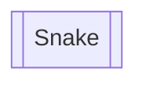

# Snakey Game  

> <strong><big><green>This is a class work for CPP course of NEU.</green></big></strong>

## project framework
The program is divided into three main parts: a rendering thread responsible for the game graphics, a client thread pool responsible for the tank control, and a server thread pool responsible for game logic.  
The double border block means a module file, and others means the class or the function.

#### requests  
An Internet module for the connect to the game server. So The game supports the online mode.  
It is based on the `asio` module, and get a little development.  

#### client  
An Internet module for the game server, which can be used to take logic control.  
Is is also based on the `asio` module.

#### threads
The thread control which based on the `asio` module.  

#### Tanks
The Tanks module, It should have a father class which called "tank\_base", and it has the sub classes including "tank\_local", "tank\_ai", "tank\_online".  
It have an other class named "weapon", also contains its own sub classes.

#### UI
Using EasyX or Qt as the UI module for the project.  

## coing standard
Using the cpp 17 standard.  

## commit standard
using the ali standard like the last project.

